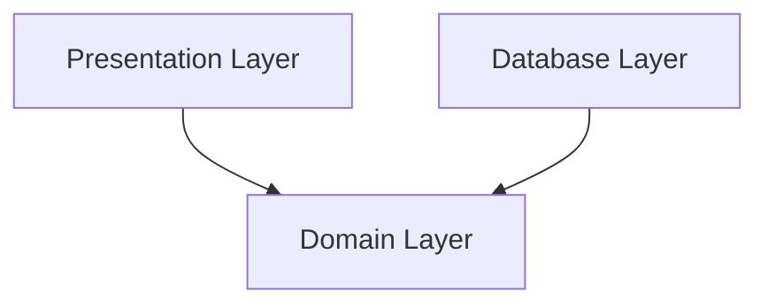

# Continue working:
- check if label is still available on node after restart - f not use https://learn.microsoft.com/en-us/azure/aks/use-labels 
- replace port-forwarding using loadbalancer
  - https://kubernetes.io/docs/tasks/access-application-cluster/create-external-load-balancer/
  - https://learn.microsoft.com/en-us/azure/aks/load-balancer-standard
- access app via rproxy
  - https://earthly.dev/blog/setup-reverse-proxy-kubernetes-nginx/
- deploy traefik
  - https://platform9.com/learn/v1.0/tutorials/traefik-ingress
- currently - storage class local - replace bei azure files
  - build it manually  https://learn.microsoft.com/en-us/azure/aks/azure-csi-files-storage-provision#statically-provision-a-volume
  - build it via dynamically via storage class https://learn.microsoft.com/en-us/azure/aks/azure-csi-files-storage-provision#dynamically-provision-a-volume (current assumptions: rights not correctly configured)


# Docker 
```
docker build . -t app:sqlite

docker tag app:sqlite p1containerregistry.azurecr.io/app:sqlite

az acr login --name p1containerregistry

docker push p1containerregistry.azurecr.io/app:sqlite
```


# Instructions
Start Postgres 
``````
docker run --name pgsql --rm -e POSTGRES_PASSWORD=test1234 -p 5432:5432 -v ${PWD}/postgres-docker:/var/lib/postgresql/data postgres
https://earthly.dev/blog/postgres-docker/
``````


## Test Setup
- using testing client for the app
- database: 
  - using in rollback for sqlite db


# example-package

# source
- book: https://www.cosmicpython.com/book/preface.html
- code examples: https://github.com/cosmicpython/code

# Erkenntnisse

## pytest

- Python path: can be set in pytest.ini: https://pytest-with-eric.com/introduction/pytest-pythonpath/


# DDD Terms
- Business Domain: Problem you want to solve
- Ubiquitious language: business jargon

# Dependencies
- arrow means "depends on": A -> B. Modul A depends on B, e.g. A uses functions of B
- Main Goal: __we want our domain model to have no dependencies whatsoever.__ ("no stateful dependencies." Depending on a helper library is fine; depending on an ORM or a web framework is not.)



# SQLALchemy
## Glossar
- Session: establishes all conversations with the database and represents a “holding zone” for all the objects which you’ve loaded or associated with it during its lifespan. It provides the interface where SELECT and other queries are made that will return and modify ORM-mapped objects.
- engine: home base - both a Dialect and a Pool, which together interpret the DBAPI’s module functions as well as the behavior of the database.
- Dialect: behavior of a specific database and DB-API combination
- Pool: connection pool

# Tips
- Define focus time
- Stop in the middle


az storage account create -n p1aksstraccount -g MC_p1-python-app-test_p1-python-aks_westeurope -l westeurope --sku Standard_LRS


export AZURE_STORAGE_CONNECTION_STRING=$(az storage account show-connection-string -n p1aksstraccount -g p1-python-app-test -o tsv)

az storage share create -n p1akstrshare --connection-string $AZURE_STORAGE_CONNECTION_STRING

STORAGE_KEY=$(az storage account keys list --resource-group MC_p1-python-app-test_p1-python-aks_westeurope --account-name p1aksstraccount --query "[0].value" -o tsv)