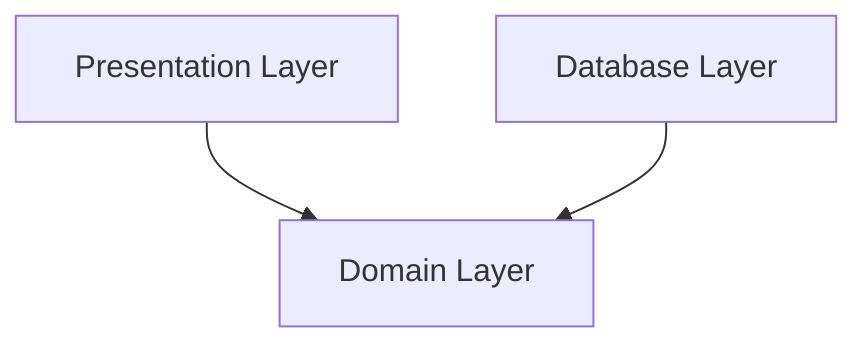

# example-package

# source
- book: https://www.cosmicpython.com/book/preface.html
- github: https://github.com/patnebe/architecture-patterns-with-python

# Erkenntnisse

## pytest

- Python path: can be set in pytest.ini: https://pytest-with-eric.com/introduction/pytest-pythonpath/

# DDD Terms
- Business Domain: Problem you want to solve
- Ubiquitious language: business jargon

# Continue reading: 
https://www.cosmicpython.com/book/chapter_01_domain_model.html

So far, we can manage the implementation by just incrementing and decrementing Batch.available_quantity, but as we get into deallocate() tests, we’ll be forced into a more intelligent solution:

# Dependencies
- arrow means "depends on": A -> B. Modul A depends on B, e.g. A uses functions of B
- Main Goal: __we want our domain model to have no dependencies whatsoever.__ ("no stateful dependencies." Depending on a helper library is fine; depending on an ORM or a web framework is not.)

