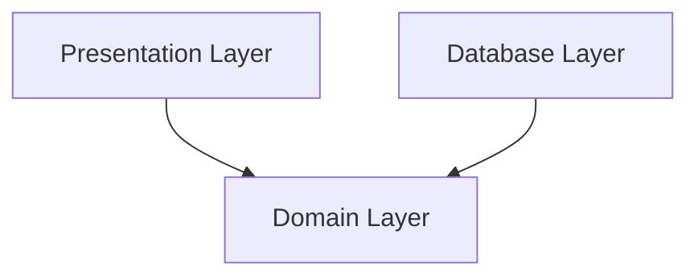

# Continue working:

chapter 4 - tasks
- implement service layer test

## Test Setup
- using testing client for the app
- database: 
  - using in rollback for sqlite db

# example-package

# source
- book: https://www.cosmicpython.com/book/preface.html
- code examples: https://github.com/cosmicpython/code

# Erkenntnisse

## pytest

- Python path: can be set in pytest.ini: https://pytest-with-eric.com/introduction/pytest-pythonpath/

# DDD Terms
- Business Domain: Problem you want to solve
- Ubiquitious language: business jargon

# Dependencies
- arrow means "depends on": A -> B. Modul A depends on B, e.g. A uses functions of B
- Main Goal: __we want our domain model to have no dependencies whatsoever.__ ("no stateful dependencies." Depending on a helper library is fine; depending on an ORM or a web framework is not.)

# SQLALchemy
## Glossar
- Session: establishes all conversations with the database and represents a “holding zone” for all the objects which you’ve loaded or associated with it during its lifespan. It provides the interface where SELECT and other queries are made that will return and modify ORM-mapped objects.
- engine: home base - both a Dialect and a Pool, which together interpret the DBAPI’s module functions as well as the behavior of the database.
- Dialect: behavior of a specific database and DB-API combination
- Pool: connection pool

# Tips
- Define focus time
- Stop in the middle